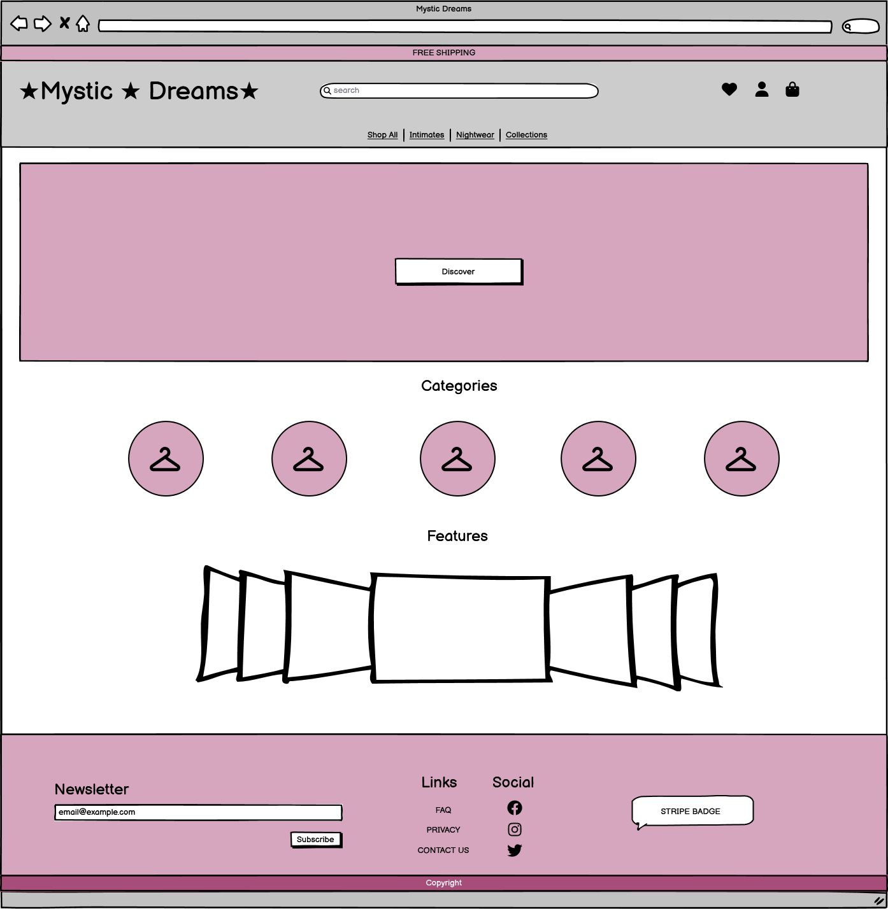
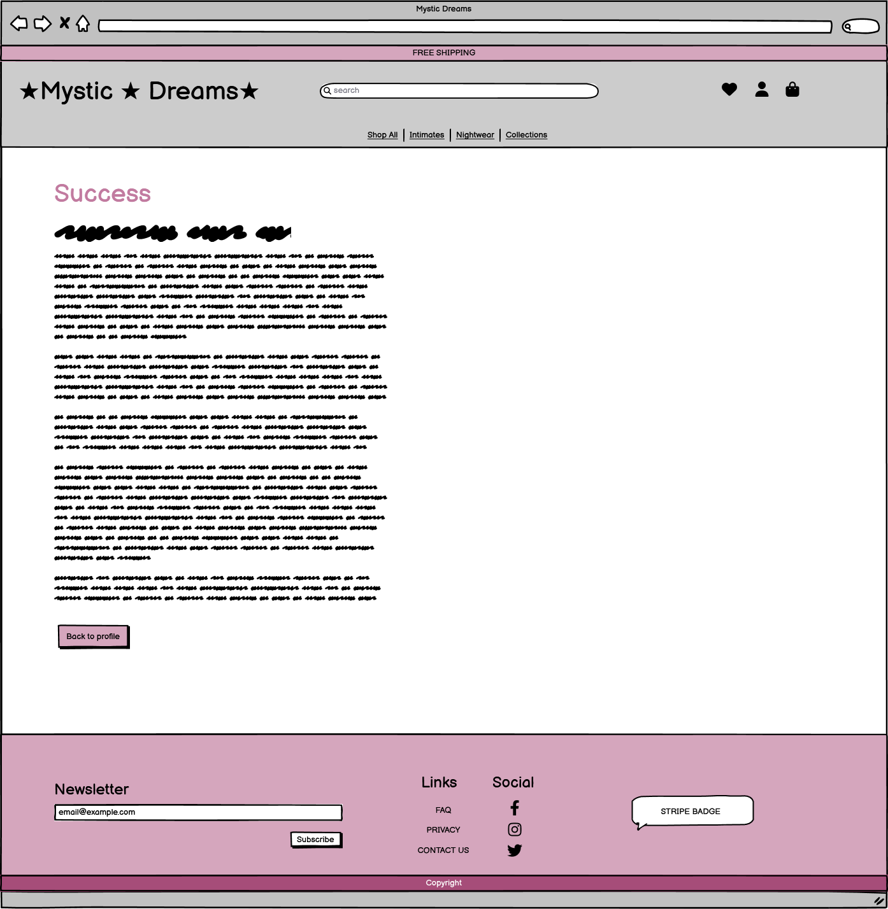
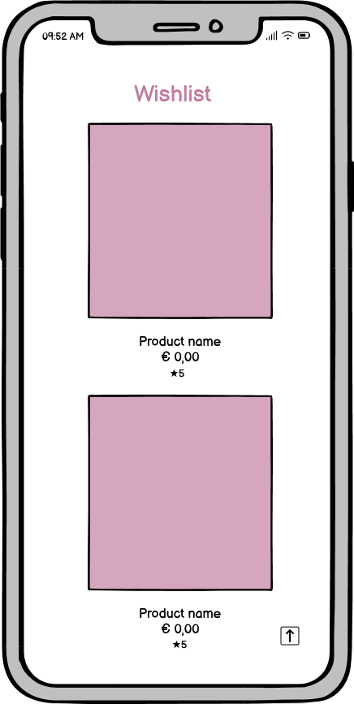
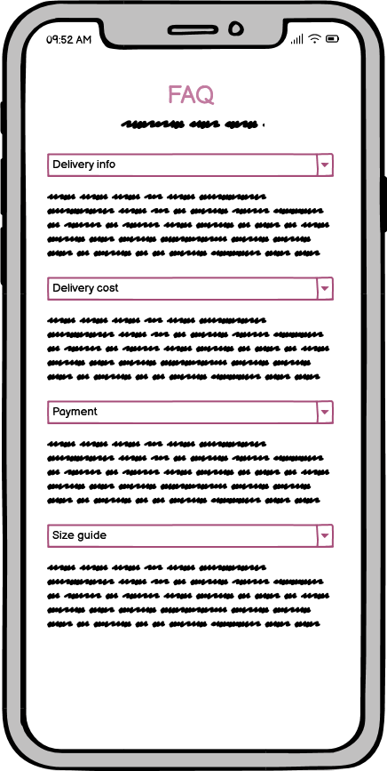
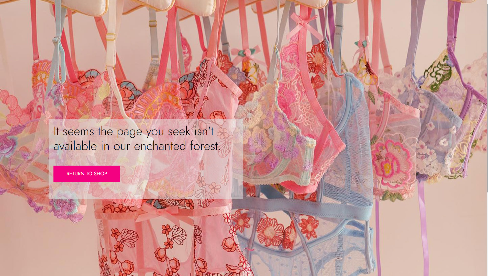

# Mystic Dreams

 ## Overview

 

 Welcome to Mystic Dreams, where elegance meets enchantment in the world of delicate lingerie and nightwear. This Django-based e-commerce platform is designed to immerse you in a fairy-themed shopping experience, offering a curated selection of intimate apparel that combines sophistication with a touch of magic; It is also a demonstration of the skills and knowledge I have gained as a student of the Full Stack Developer diploma at Code Institute. 
 This project showcases my ability to develop and integrate various technologies to deliver a seamless and effective e-commerce experience serving as a testament to my learning journey, highlighting the practical and industry-relevant skills I've acquired in development.
 
 [View the deployed project here](https://mystic-intimate-b5e28fa0a305.herokuapp.com/).

 ## Table of Contents

- [Marketing Strategies](#marketing-strategies)
  - [Business Model: B2C](#business-model-b2c)
  - [SEO Strategy](#seo-strategy)
    - [On-page](#on-page)
    - [Off-page](#off-page)
- [Scope](#scope)
  - [Existing Features](#existing-features)
  - [Future Features](#future-features)
- [User Experience (UX)](#user-experience-ux)
  - [User Stories](#user-stories)
    - [Viewing and Navigation](#viewing-and-navigation)
    - [Registration and User Accounts](#registration-and-user-accounts)
    - [Sorting and Searching](#sorting-and-searching)
    - [Purchasing and Checkout](#purchasing-and-checkout)
    - [Admin and Store Management](#admin-and-store-management)
  - [Agile Tools](#agile-tools)
  - [Wireframes](#wireframes)
- [Design](#design)
  - [Logo](#logo)
  - [Typography](#typography)
  - [Color Scheme](#color-scheme)
  - [Layout](#layout)
- [Technologies](#technologies)
  - [Languages](#languages)
  - [Frameworks, Libraries, and Programs Used](#frameworks-libraries-and-programs-used)
- [Testing](#testing)
  - [Validating](#validating)
    - [HTML Validation](#html-validation)
    - [CSS Validation](#css-validation)
    - [JavaScript Validation](#javascript-validation)
    - [CI Python Linter - PEP8](#ci-python-linter---pep8)
    - [Lighthouse](#lighthouse)
  - [Manual Testing](#manual-testing)
    - [Navigation Bar](#navigation-bar)
    - [Index](#index)
    - [Footer](#footer)
    - [Products Page](#products-page)
    - [Product Detail Page](#product-detail-page)
    - [Product Management](#product-management)
    - [Wishlist Page](#wishlist-page)
    - [Profile Page](#profile-page)
    - [Shopping Bag Page](#shopping-bag-page)
    - [Checkout Page](#checkout-page)
    - [Order History / Checkout Success](#order-history--checkout-success)
  - [Automated Tests](#automated-tests)
- [Deployment](#deployment)
  - [Cloning](#cloning)
  - [Fork](#fork)
  - [Stripe Setup](#stripe-setup)
  - [Environment Variables Setup](#environment-variables-setup)
  - [Local Deployment](#local-deployment)
  - [Deployment on Heroku](#deployment-on-heroku)
- [Credits](#credits)
  - [Content](#content)
  - [Media](#media)
  - [Acknowledgments](#acknowledgments)

# Marketing Strategies

 ## Business Model: B2C

 The B2C model is ideal for this project as it directly targets individual consumers who are interested in fairy-themed, handmade lingerie and nightwear. This model allows us to engage directly with end users, providing a personalized shopping experience that emphasizes unique products. By selling directly to consumers, we can control our brand narrative, manage customer relationships, and quickly adapt to market changes and consumer preferences. This approach is especially effective in the niche market of thematic, delicately crafted intimate apparel, where consumer engagement and loyalty are key to business success.

 - **Target Audience**: Primarily targets fashion-forward young adults and lovers of fantasy and fairy tales. This audience appreciates the unique, magical theme of lingerie and nightwear and values the quality and uniqueness of handcrafted items.

 - **Theme**: The platform immerses customers in a fairy-themed world, offering a collection of intimate apparel that combines elegance with mystical charm. The products are not just items but symbols of enchantment and luxury.

 - **Online Shoppers**: The website caters to online shoppers looking for a seamless, enchanting shopping experience. Offering intuitive navigation, secure checkout, and a user-friendly interface, ensuring that every visit is a delightful journey.

 ## SEO Strategy

 Implementing a robust SEO strategy is crucial as it enhances the online visibility and attracts more targeted traffic to the website. By optimizing the site with relevant keywords, meta tags, and a structured site layout, we improve our rankings in search engine results. This not only helps potential customers discover a fairy-themed lingerie and nightwear more easily but also increases the likelihood of conversions. Effective SEO is fundamental in building a sustainable online presence and driving the business growth in a competitive market.

 ### On-page

 - **Keyword Optimization**: Strategical use of keywords related to 'fairy-themed lingerie,' 'enchanting nightwear,' and 'luxury intimate apparel' to improve visibility and attract a niche audience interested in an unique theme.

 - **Site Structure**: The website structure is optimized for both users and search engines. Clear categorization of products into collections like 'Enchanted Garden' and 'Fairy Whisper' makes navigation intuitive and enhances the SEO-friendly nature of the site.

 - **Robots.txt**: Robots.txt file to manage crawler access to the site, ensuring that search engines are indexing the content correctly without accessing sensitive areas.

 - **XML Sitemaps**: Up-to-date XML sitemap that helps search engines more intelligently crawl the site. It lists the URLs for a site along with additional metadata about each URL (when it was last updated, how often it changes, and how important it is relative to other URLs in the site) so that search engines can more intelligently crawl the site.

 ### Off-page

 - **Email Marketing**: Email marketing remains one of the most effective marketing tools due to its direct approach and high conversion rates. It's a strategic method to maintain customer engagement, incentivize repeat purchases, and keep audience informed about the latest products and special events. Newsletter Subscription allows subscribers to receive exclusive discounts, be the first to see new products, and learn about upcoming sales. By signing up, customers stay connected, receiving curated content. This direct line of communication serves as a continual reminder of our offerings and reinforces brand loyalty.

  - **Social Media**: Utilizing [Facebook](https://www.facebook.com/mysticintimate/) as a marketing tool is vital for modern e-commerce businesses connecting directly with target audience, fostering community engagement and brand loyalty. It helps build an organic growth community through shares and recommendations.
 By regularly posting updates, engaging content, and interactive posts, we enhance customer interaction and brand recognition. The analytics provided by Facebook also give valuable insights into customer preferences and behavior, guiding marketing strategies.

  

# Scope

 ## Existing Features

 **Home Page**
 - Attractive Banner with Promotions engaging visitors immediately with current deals and offers.
 - Navigation Bar includes Home, Shop, Collections, Profile, and Cart buttons for easy navigation.
 - Hero Image featuring a "Discover" link to encourage exploration of the full catalog.
 - Product Categories with Icons simplifies the search for products by displaying categories visually.
 - Featured Products Section highlighting select products to capture interest and boost sales.
 - Footer containing website information and a newsletter sign-up to keep visitors informed and engaged.

 **Products Page**
 - Displays a list of products with options to filter by category, price, rating, color, and collections.
 - Includes a search functionality to help users find specific products easily.

 **Product Detailed Page**
 - Provides detailed information about each product, including images, descriptions, sizes.
 - Offers "Add to Cart" and "Add to Wishlist" options for convenience and personalized shopping.

 **Profiles**
 - Allows user registration and login.
 - Enables users to save delivery information for faster checkout.
 - Provides a view of the user's last orders, enhancing trackability and repeat purchases.
 - Features a wishlist where registered users can add their favorite products. This wishlist is accessible from the profile page, making it easy to track desired items and move them to the cart when ready.

 **Guest Checkout**
 - Provides an option for guests to complete purchases without creating an account.
 - Sends a confirmation email with order tracking information to ensure guests can follow their order's progress.

 **Shopping Cart and Checkout**
 - Simplifies cart management.
 - Ensures a secure checkout process.
 - Utilizes Stripe for payments.

 **Admin Features**
 - Allows admins to update product listings directly, bypassing the traditional admin panel for streamlined management.

 ## Future Features:

 - **Implementation of a Voucher System**: Allows the input of voucher codes at checkout, enabling shoppers to receive discounts on their purchases. This system also allows for the creation and management of promotional codes to facilitate special offers and discounts.

 - **Product Review Capability**: Provides functionality for customers to leave and read reviews on purchased items. This feature will include moderation tools to ensure that only appropriate and helpful content is displayed on the product pages.

 - **Expansion of Payment Options**: Integration of additional payment gateways such as PayPal, Apple Pay, and Google Pay, enhancing the checkout process by offering customers multiple payment methods to choose from.

 - **Social Media Login**: Introduction of the ability to log in using social media accounts, such as Facebook, Google, or Twitter. This feature aims to streamline the login process and improve user convenience, making it easier for new and returning customers to access and engage with the site.

# User Experience

 ## User Stories

 ### Viewing and Navigation

 - As a shopper, I can navigate through the website using the navbar so that I can access different sections easily.
 - As a shopper, I can view a list of products so that I can select some to purchase.
 - As a shopper, I can view individual product details to identify the price, description, product rating, product image, available sizes, and collections.
 - As a shopper, I can easily view the total of my purchases at any time to manage my spending effectively.
 - As a shopper, I can interact with the footer to sign up for newsletters, access social media pagesand navigate to informational pages so that I can stay connected and informed about the offerings and policies of the website.

 ### Registration and User Accounts

 - As a user, I can easily register for an account to have a personal account and view my profile.
 - As a user, I can easily login or logout to access my personal account information.
 - As a user, I receive an email confirmation after registering to verify that my account registration was successful.
 - As a user, I can have a personalized user profile to view my personal order history, order confirmations, and save my payment information.

 ### Sorting and Searching

 - As a shopper, I can sort the list of available products to easily identify the best-rated, best-priced, and categorically sorted products.
 - As a shopper, I can sort products within a specific category or collection to find the best-priced or best-rated products, or sort the products by name.
 - As a shopper, I can search for a product by name or description to find a specific product I'd like to purchase.
 - As a shopper, I can easily see what I've searched for and the number of results to quickly decide whether the product I want is available.

 ### Purchasing and Checkout

 - As a shopper, I can add items to my wishlist so that I can save products for future consideration without adding them to my bag.
 - As a shopper, I can easily select the size and quantity of a product when purchasing it to ensure I don't accidentally select the wrong product, quantity, or size.
 - As a shopper, I can view items in my bag to be purchased to identify the total cost of my purchase and all items I will receive.
 - As a shopper, I can adjust the quantity of individual items in my bag to easily make changes to my purchase before checkout.
 - As a shopper, I can feel confident that my personal and payment information is safe and secure to provide needed information to make a purchase confidently.
 - As a shopper, I can view an order confirmation after checkout to verify that I haven't made any mistakes.
 - As a shopper, I receive an email confirmation after checking out to keep the confirmation of what I've purchased for my records.

 ### Admin and Store Management

 - As an admin, I can add a product to introduce new items to my store.
 - As an admin, I can edit/update a product to change product prices, descriptions, images, and other product criteria.
 - As an admin, I can delete a product to remove items that are no longer for sale.

 ## Agile Tools

 Agile methodologies are fundamental to this project, ensuring iterative progress, flexibility in design, and a continual focus on delivering user value. The project's Kanban board is an essential tool for visualizing workflow and task management. It is structured with columns for "To Do," "In Progress," "Done," and "Future Features," facilitating clear visibility and tracking of development stages. [View the project board here](https://github.com/users/patilacerda/projects/1).

 ## Wireframes

 <details>
 <summary>Home Page</summary>

 **Desktop:**

 

 **Mobile:**

 

 </details>

 <details>
 <summary>Product Management</summary>

 **Desktop:**

 

 **Mobile:**

 

 </details>

 <details>
 <summary>Products Page</summary>

 **Desktop:**

 

 **Mobile:**

 

 </details>

 <details>
 <summary>Product Detail</summary>

 **Desktop:**

 

 **Mobile:**

 

 </details>

 <details>
 <summary>Shopping Bag</summary>

 **Desktop:**

 

 **Mobile:**

 

 </details>

 <details>
 <summary>Checkout Page</summary>

 **Desktop:**

 

 **Mobile:**

 

 </details>

 <details>
 <summary>Checkout Success Page</summary>

 **Desktop:**

 

 **Mobile:**

 

 </details>

 <details>
 <summary>Profile Page</summary>

 **Desktop:**

 

 **Mobile:**

 

 </details>

 <details>
 <summary>Wishlist Page</summary>

 **Desktop:**

 

 **Mobile:**

 

 </details>

 <details>
 <summary>Contact Page</summary>

 **Desktop:**

 

 **Mobile:**

 

 </details>

 <details>
 <summary>FAQ Page</summary>

 **Desktop:**

 

 **Mobile:**

 

 </details>

 <details>
 <summary>Privacy Page</summary>

 **Desktop:**

 

 **Mobile:**

 

 </details>

 <details>
 <summary>404 Page</summary>

 **Desktop:**

 

 **Mobile:**

 

 </details>

# Design

 The design of Mystic Dreams reflects a blend of elegance, mysticism, and functionality, aiming to create a visually captivating and user-friendly experience.

 ## Logo

 The final design of the logo embraces the Evenstar shape from "The Lord of the Rings" intendeding to be immediately recognizable. This was chosen over initial sketches based on Gestalt theory due to its elegant and distinctive silhouette that resonates strongly with the mystical theme of the website. 

 

 ## Typography

 The website utilizes the "Jost" font from Google Fonts, for its clean and modern appearance. This sans serif font enhances on-screen readability, contributing to an overall sophisticated and contemporary look.

 ## Color Scheme

 - **Navigation and General Layout**: The primary colors for navigation and background elements are black and white, providing a stark, readable contrast that ensures content stands out effectively.
 - **Accents and Highlights**: #f30080 (neon pink) is used for buttons and headings, injecting a vibrant and magical touch that complements the mystical theme of the site.
 - **Overall Palette**: The chosen palette evokes a sense of femininity and harmony, with carefully selected shades that balance contrast and maintain visual appeal.

  

 ## Layout

 <details>
 <summary>Home Page</summary>

 **Desktop:**

 
 
 

 **Mobile:**

 
 

 </details>

 <details>
 <summary>Product Management</summary>

 **Desktop:**

 

 **Mobile:**

 
 

 </details>

 <details>
 <summary>Products Page</summary>

 **Desktop:**

 

 **Mobile:**

 

 </details>

 <details>
 <summary>Product Detail</summary>

 **Desktop:**

 

 **Mobile:**

 

 </details>

 <details>
 <summary>Bag</summary>

 **Desktop:**

 

 **Mobile:**

 

 </details>

 <details>
 <summary>Checkout Page</summary>

 **Desktop:**

 

 **Mobile:**

 

 </details>

 <details>
 <summary>Checkout Success Page</summary>

 **Desktop:**

 

 **Mobile:**

 

 </details>

 <details>
 <summary>Profile Page</summary>

 **Desktop:**

 

 **Mobile:**

 

 </details>

 <details>
 <summary>Wishlist Page</summary>

 **Desktop:**

 

 **Mobile:**

 

 </details>

 <details>
 <summary>Contact Page</summary>

 **Desktop:**

 

 **Mobile:**

 

 </details>

 <details>
 <summary>FAQ Page</summary>

 **Desktop:**

 

 **Mobile:**

 

 </details>

 <details>
 <summary>Privacy Page</summary>

 **Desktop:**

 

 **Mobile:**

 

 </details>

 <details>
 <summary>404 Page</summary>

 **Desktop:**

 

 **Mobile:**
 
 

 </details>

# Technologies

 ## Languages

 - HTML
 - CSS
 - Python
 - JavaScript

 ## Frameworks, Libraries and Programs Used

 **IDEs:**
  - [Codeanywhere](https://codeanywhere.com/): An Integrated Development Environment (IDE) used for coding, testing, and managing the project.
  - [Gitpod](https://www.gitpod.io/): Another Integrated Development Environment (IDE) used for coding, testing, and managing the project.

 **Database Storage:**
  - [ElephantSQL](https://www.elephantsql.com/): Provides PostgreSQL as a Service, which is utilized for storing application data securely and efficiently.

 **Version Control:**
  - [Git](https://git-scm.com/): Employed as the version control system to manage changes to the project's source code.

  **Code Hosting:**
  - [GitHub](https://github.com/): Hosts the code repository, enabling version tracking and collaboration.

 **Deployment:**
  - [Heroku](https://www.heroku.com/): Platform-as-a-Service (PaaS) used to deploy the web application, allowing it to be accessible on the internet.

 **Design Tools:**
  - [Photoshop](https://www.adobe.com/products/photoshop.html): Utilized for creating and editing images and logo.
  - [Balsamiq](https://balsamiq.com/): Used for drafting design mockups and wireframes of the website.

 **Development Packages:**
  - [Django](https://www.djangoproject.com/): The primary web framework used for building the website.
  - [django-allauth](https://django-allauth.readthedocs.io/en/latest/): Integrates authentication and registration functionalities.
  - [dj-database-url](https://pypi.org/project/dj-database-url/): Helps in parsing database URLs from the environment for Django.
  - [psycopg2](https://pypi.org/project/psycopg2/): Acts as the PostgreSQL adapter for Python.
  - [django-crispy-forms](https://django-crispy-forms.readthedocs.io/en/latest/): Used for rendering beautiful Django forms.
  - [django-storages](https://django-storages.readthedocs.io/en/latest/): A collection of custom storage backends for Django.
  - [cloudinary](https://cloudinary.com/): Manages image and video upload, storage, optimization, and CDN.
  - [dj3-cloudinary-storage](https://pypi.org/project/dj3-cloudinary-storage/): Connects Django to Cloudinary's storage, making file uploads seamless.
  - [whitenoise](http://whitenoise.evans.io/en/stable/): Simplifies static file serving in Django, especially useful when deploying on Heroku.
  - [gunicorn](https://gunicorn.org/): Serves Django applications from a WSGI application in a production setting.

 **Other Tools:**
  - [Bootstrap](https://getbootstrap.com/): Front-end framework used for creating responsive and mobile-first web pages.
  - [Google Fonts](https://fonts.google.com/): Provides web fonts that enhance the typography of the project.
  - [Font Awesome](https://fontawesome.com/): Delivers icons used throughout the website for a polished look.
  - [Favicon.io](https://favicon.io/): Used to create favicon that help users identify the site in browser tabs.

# Testing

 ## Validating

 ### HTML Validation - [W3C Markup Validation Service](https://validator.w3.org/nu/)

| Folder                       | File                                      | Status |
|------------------------------|-------------------------------------------|--------|
| Bag                          | bag.html                                  | pass   |
| Checkout                     | checkout.html                             | pass   |
| Checkout                     | checkout_success.html                     | pass   |
| Home                         | contact_us.html                           | pass   |
| Home                         | faq.html                                  | pass   |
| Home                         | index.html                                | pass   |
| Home                         | privacy.html                              | pass   |
| Products                     | products.html                             | pass   |
| Products                     | product_detail.html                       | pass   |
| Products                     | edit_product.html                         | pass   |
| Products                     | add_product.html                          | pass   |
| Products/includes            | quantity_input_script.html                | pass   |
| Products/custom_widget_templates | custom_clearable_file_input.html      | fail   |
| Profiles                     | profile.html                              | pass   |
| Profiles                     | wishlist.html                             | pass   |
| Templates                    | base.html                                 | pass   |
| Templates/errors             | 404.html                                  | pass   |
| Templates/includes           | footer.html                               | pass   |
| Templates/includes           | main-nav.html                             | pass   |
| Templates/includes           | mobile-top-header.html                    | pass   |
| Templates/includes/toasts    | toast_success.html                        | pass   |
| Templates/includes/toasts    | toast_error.html                          | pass   |
| Templates/includes/toasts    | toast_info.html                           | pass   |
| Templates/includes/toasts    | toast_warning.html                        | pass   |

  During validation testing, an error was encountered in custom_clearable_file_input.html due to a duplicate attribute ID. This issue was highlighted by the HTML validation service, pinpointing a compliance error with HTML standards.

  **Cause of the Issue:** This error occurs because the input element within the custom widget explicitly sets an id="new-image". At the same time, Django’s built-in  tries to apply another id, which is automatically generated based on the form field’s name. This results in the HTML element having two different id attributes.

  ```python
  <span class="btn btn-black rounded-0 btn-file">
    Select Image <input id="new-image" type="{{ widget.type }}" name="{{ widget.name }}"
        >
  </span>
  ```

  This issue has been acknowledged, and while it does not impact the functionality or user interaction on the website, it does pose a standards compliance issue.

 ### CSS Validation - [W3C CSS Validation Service](https://jigsaw.w3.org/css-validator/)

| Folder                       | File                                      | Status |
|------------------------------|-------------------------------------------|--------|
| Checkout/static/checkout/css | checkout.css                              | pass   |
| Profiles/static/profiles/css | profile.css                               | pass   |
| static/css                   | base.css                                  | pass   |
 
 The CSS code passed validation with no errors.

 ### JavaScript Validation - [JSHint](https://jshint.com/)

| Folder                       | File                                      | Status |
|------------------------------|-------------------------------------------|--------|
| Checkout/static/checkout/js  | stripe_elements.js                        | pass   |
| Profiles/static/profiles/js  | countryfield.js                           | pass   |

 The JavaScript code passed validation with no errors.

 ### CI Python Linter - [PEP8](https://pep8ci.herokuapp.com/)

| Folder       | File                     | Status |
|--------------|--------------------------|--------|
| Checkout     | admin.py                 | pass   |
| Checkout     | apps.py                  | pass   |
| Checkout     | forms.py                 | pass   |
| Checkout     | models.py                | pass   |
| Checkout     | signals.py               | pass   |
| Checkout     | tests.py                 | pass   |
| Checkout     | urls.py                  | pass   |
| Checkout     | views.py                 | pass   |
| Checkout     | webhook_handler.py       | pass   |
| Checkout     | webhooks.py              | pass   |
| Home         | apps.py                  | pass   |
| Home         | tests.py                 | pass   |
| Home         | urls.py                  | pass   |
| Home         | views.py                 | pass   |
| Mystic_dream | urls.py                  | pass   |
| Mystic_dream | views.py                 | pass   |
| Products     | admin.py                 | pass   |
| Products     | apps.py                  | pass   |
| Products     | forms.py                 | pass   |
| Products     | models.py                | pass   |
| Products     | tests.py                 | pass   |
| Products     | urls.py                  | pass   |
| Products     | views.py                 | pass   |
| Products     | widgets.py               | pass   |
| Profiles     | admin.py                 | pass   |
| Profiles     | apps.py                  | pass   |
| Profiles     | forms.py                 | pass   |
| Profiles     | models.py                | pass   |
| Profiles     | tests.py                 | pass   |
| Profiles     | urls.py                  | pass   |
| Profiles     | views.py                 | pass   |

 No errors were returned when passing through the PEP8.
 Flake8 flagged lines too long in migration files and the settings file, which were not modified as they do not affect project functionality.

 ### Lighthouse

 Lighthouse reports a 92% performance score for the desktop version of the site.

 

 ## Manual testing

 ### Navigation Bar

 | Event                 | Expected Functionality                                                       | Steps                                                                                   | Status |
|-----------------------|------------------------------------------------------------------------------|-----------------------------------------------------------------------------------------|--------|
| Search Button         | Submits the search form and directs the user to the products page with search results. | Enter a search query in the search input field. Click the search button.                | pass   |
| Wishlist Button       | Directs the user to the login page if not logged in, otherwise to their wishlist page. | Click the wishlist button. Verify navigation to login or wishlist page based on login status. | pass   |
| My Account Button     | Opens a dropdown menu with options for registering or logging in.             | Click the My Account button. Verify that the dropdown menu appears with options.       | pass   |
| Register Button (Dropdown) | Directs the user to the registration page.                               | Click the Register button in the dropdown. Verify it navigates to the registration page. | pass   |
| Login Button (Dropdown) | Directs the user to the login page.                                         | Click the Login button in the dropdown. Verify it navigates to the login page.          | pass   |
| Shopping Bag Button   | Directs the user to the shopping bag page.                                   | Click the Shopping Bag button. Verify it navigates to the shopping bag page.           | pass   |
| Mobile Search Button  | Opens a search input field for mobile users.                                 | Click the search button. Verify the search input field appears.    | pass   |

 ### Index

| Event                         | Expected Functionality                                   | Steps                                                                    | Status |
|-------------------------------|----------------------------------------------------------|--------------------------------------------------------------------------|--------|
| Discover Now Button           | Directs the user to the products page.                   | Click the Discover Now button. Verify it navigates to the products page. | pass   |
| Category Buttons              | Directs the user to the products page filtered by the selected category. | Click a category button. Verify it navigates to the products page with the selected category filter applied. | pass   |
| Carousel Previous Button      | Navigates to the previous set of featured products.      | Click the Previous button on the carousel. Verify it displays the previous set of featured products. | pass   |
| Carousel Next Button          | Navigates to the next set of featured products.          | Click the Next button on the carousel. Verify it displays the next set of featured products. | pass   |
| Product View Details Buttons  | Directs the user to the detailed view page of the selected product. | Click the View Details button on a product in the carousel. Verify it navigates to the product detail page. | pass   |

 ### Footer

| Event                   | Expected Functionality                                   | Steps                                                                             | Status |
|-------------------------|----------------------------------------------------------|-----------------------------------------------------------------------------------|--------|
| Newsletter Subscribe Button | Submits the subscription form for the newsletter.       | Enter an email address in the newsletter input field. Click the Subscribe button. Verify the subscription is successful. | pass   |
| Social Media Buttons    | Directs the user to the respective social media pages in a new tab. | Click each social media button. Verify it opens the respective social media page in a new tab. | pass   |
| Footer FAQ Button       | Directs the user to the FAQ page.                         | Click the FAQ button. Verify it navigates to the FAQ page.                        | pass   |
| Footer Privacy Button   | Directs the user to the Privacy Policy page.              | Click the Privacy button. Verify it navigates to the Privacy Policy page.        | pass   |
| Footer Contact Us Button| Directs the user to the Contact Us page.                  | Click the Contact Us button. Verify it navigates to the Contact Us page.         | pass   |

 ### Products Page

| Event                        | Expected Functionality                                  | Steps                                                                   | Status |
|------------------------------|---------------------------------------------------------|-------------------------------------------------------------------------|--------|
| Colour Filter Dropdown       | Allows users to filter products by selected color.      | Select a color from the dropdown. Verify the page updates to show only products of the selected color. | pass   |
| Sort Selector Dropdown       | Allows users to sort products based on different criteria. | Select a sorting option from the dropdown. Verify the page updates to display products in the selected order. | pass   |
| Wishlist Button (each product card) | Adds the product to the user's wishlist if logged in, otherwise directs to the login page. | Click the Wishlist button on a product card. Verify it directs to the login page if not logged in. Log in and click the Wishlist button again to ensure it adds the product to the wishlist. | pass   |
| View Details Button (each product card) | Directs the user to the product detail page for the specific product. | Click the View Details button on a product card. Verify it navigates to the product detail page. | pass   |
| Edit Button (Superuser Only) | Directs the superuser to the edit product page.         | Ensure the Edit button is visible for superusers. Click the Edit button and verify it navigates to the edit product page. | pass   |
| Delete Button (Superuser Only) | Directs the superuser to the products page with a success message after deletion. | Ensure the Delete button is visible for superusers. Click the Delete button, verify it deletes the product, and then redirects to the products page displaying a successful deletion message. | pass   |
| Back to Top Button           | Scrolls the page back to the top when clicked.          | Scroll down the page. Click the Back to Top button and verify it scrolls back to the top. | pass   |

 ### Product Detail Page

 | Event                 | Expected Functionality                                    | Steps                                                                                     | Status |
|-----------------------|-----------------------------------------------------------|-------------------------------------------------------------------------------------------|--------|
| Add to Wishlist       | Allows logged-in users to add or delete the product to their wishlist. | Verify the "Add to Wishlist" button is visible for authenticated users. Click the button and check if the product is added to the wishlist. | pass   |
| Edit Button (Superuser Only) | Directs superuser to the edit product page.           | Ensure "Edit" link is visible for superusers. Click "Edit" and verify navigation to the edit product page. | pass   |
| Delete Button (Superuser Only) | Directs the superuser to the products page with a success message after deletion. | Ensure the Delete button is visible for superusers. Click the Delete button, verify it deletes the product, and then redirects to the products page displaying a successful deletion message. | pass   |
| Size Selection        | Allows users to select product size from a dropdown.        | Verify that the size dropdown is visible if the product has sizes. Select different sizes and check updates correctly. | pass   |
| Quantity Selection    | Allows users to set the product quantity.                   | Verify the quantity input is visible. Use the "+" and "-" buttons to adjust quantity and ensure it updates correctly, remaining within limits. | pass   |
| Add to Bag            | Adds the product to the shopping bag with selected size and quantity. | Verify the "Add to Bag" button is displayed. Click "Add to Bag" and ensure the product with selected options is added to the shopping bag. | pass   |
| Keep Shopping         | Redirects the user to the product listing page.             | Verify the "Keep Shopping" button is displayed. Click and ensure navigation back to the product listing page. | pass   |

 ### Product Management

| Event                 | Expected Functionality                                              | Steps                                                                                        | Status |
|-----------------------|---------------------------------------------------------------------|----------------------------------------------------------------------------------------------|--------|
| Form Submission (Add) | Adds a new product to the inventory and displays a success message. | Navigate to the Add Product page, fill out the form with and without selecting an image, and submit. Verify that the product is added with a success message displayed on the products page. If no image is uploaded, verify the default "unavailable image" is used. | pass   |
| Form Submission (Edit) | Updates an existing product's details in the inventory and displays a success message. | Navigate to the Edit Product page, modify the details of an existing product, with or without changing the image, and submit. Verify that the product details are updated with a success message displayed on the products page. If a new image is not uploaded, verify the existing image remains. | pass   |
| Cancel Button         | Redirects to the products page without adding or updating a product. | Navigate to the Add/Edit Product page, start filling out the form, then click the 'Cancel' button. Verify redirection to the products page and confirm that **no new changes** have been made. | pass   |

 ### Wishlist Page

| Event                        | Expected Functionality                                  | Steps                                                                   | Status |
|------------------------------|---------------------------------------------------------|-------------------------------------------------------------------------|--------|
| View Details Button (each product card) | Directs the user to the product detail page for the specific product. | Click the View Details button on a product card. Verify it navigates to the product detail page. | pass   |

 ### Profile Page

| Event                    | Expected Functionality                                  | Steps                                                                   | Status |
|--------------------------|---------------------------------------------------------|-------------------------------------------------------------------------|--------|
| Update Information Button| Submits the form to update the user's default delivery information. | Enter new delivery information in the form fields. Click the Update Information button and verify the information is updated. | pass   |
| Order Number Link (each order in order history) | Directs the user to the detailed order history page for the specific order. | Click an order number link. Verify it navigates to the detailed order history page. | pass   |

 ### Shopping Bag Page

 | Event                      | Expected Functionality                                  | Steps                                                                                           | Status |
|----------------------------|---------------------------------------------------------|-------------------------------------------------------------------------------------------------|--------|
|Keep Shopping Button       | Redirects the user back to the products page to continue shopping. | Click the "Keep Shopping" button. Verify that it navigates to the products page.              | pass   |
|Secure Checkout Button     | Redirects the user to the checkout page to proceed with the purchase. | Click the "Secure Checkout" button. Verify that it navigates to the checkout page.            | pass   |
|Decrement Quantity Button  | Decreases the quantity of the specific item in the shopping bag. | Click the "-" button next to an item. Verify that the quantity decreases and the totals are updated correctly. | pass   |
|Increment Quantity Button  | Increases the quantity of the specific item in the shopping bag. | Click the "+" button next to an item. Verify that the quantity increases and the totals are updated correctly. | pass   |
|Update Link                | Updates the quantity of the specific item in the shopping bag. | Change the quantity of an item. Click the "Update" link. Verify that the quantity is updated and the totals are recalculated correctly. | pass   |
|Remove Item Link           | Removes the specific item from the shopping bag.       | Click the "Remove" link next to an item. Verify that the item is removed and the totals are updated correctly. | pass   |

 ### Checkout Page

| Event                 | Expected Functionality                                  | Steps                                                                   | Status |
|-----------------------|---------------------------------------------------------|-------------------------------------------------------------------------|--------|
| Adjust Bag Button     | Redirects the user back to the shopping bag page to make adjustments to the order. | Click the Adjust Bag button and verify it navigates to the shopping bag page. | pass   |
| Complete Order Button | Submits the order for processing and completes the payment. | Fill in the necessary payment and delivery details. Click the Complete Order button and verify the order is submitted successfully. | pass   |

 ### Order History / Checkout Success

| Event                | Expected Functionality                                  | Steps                                                                   | Status |
|----------------------|---------------------------------------------------------|-------------------------------------------------------------------------|--------|
| Back to Profile Button (registered user) | Redirects the user back to their profile page.          | Click the Back to Profile button. Verify it navigates to the profile page. | pass   |
|Keep Shopping Button       | Redirects the user back to the products page to continue shopping. | Click the "Keep Shopping" button. Verify that it navigates to the products page.              | pass   |

 ## Automated tests

 Tests made with django TestCase - 29 tests were performed

 - Bag view:

 

 - Checkout View:

 

  - Home View:

 

  - Products View:

 

  - Profiles View:

 

# Deployment

 This project was developed using the [CI full template](https://github.com/Code-Institute-Org/ci-full-template) repository provided by Code Institute and hosted on GitHub.

 ## Cloning

 To clone the repository, follow these steps:

 1. Go to the [repository link](https://github.com/patilacerda/Mystic_Dream-PP5) on GitHub.
 2. Under the 'Code' button, then choose between the cloning options: HTTPS, SSH, or GitHub CLI. Select preferred method.
 3. Copy the URL provided.
 4. Open your Terminal or Command Prompt.
 5. Navigate to the directory where you want to clone the repository using the `cd` command to change the current working directory. 
 6. Type the command `git clone https://github.com/patilacerda/Mystic_Dream-PP5` and replace the URL with the one you copied if different.
 7. Press 'Enter' to execute the command and create a local clone of the repository.

 ## Fork

 To fork the repository, follow these steps:

 1. Go to the [repository link](https://github.com/patilacerda/Mystic_Dream-PP5) on GitHub.
 2. In the upper right corner of the page, click on the 'Fork' button. This action will create a copy of the repository in your own GitHub account.

 ## Stripe setup

 Setting up Stripe properly is crucial for handling payments securely:

 1. Log into [Stripe account](https://dashboard.stripe.com/login).
 2. Go to the Developers section and select the API keys tab.
 3. Copy `Publishable Key` and `Secret Key`.
 4. Add these keys to `env.py` file:

 ```python
 os.environ['STRIPE_PUBLIC_KEY'] = 'your_publishable_key_here'
 os.environ['STRIPE_SECRET_KEY'] = 'your_secret_key_here'
 ```

 5. Navigate to Webhooks under the Developers tab and click 'Add endpoint'.
 6. Set up the endpoint URL and select the events the webhook should receive.
 7. After deploying, perform a test transaction to ensure webhooks are functioning correctly.

 ## Environment Variables Setup

 Before deploying, set up your `env.py` to store sensitive configuration securely:

 ```python
 import os

 os.environ['DEVELOPMENT'] = "True"
 os.environ['SECRET_KEY'] = 'your_secret_key_here'
 os.environ['DATABASE_URL'] = 'your_database_url_here'
 os.environ['CLOUDINARY_URL'] = 'your_cloudinary_url_here'
 os.environ['EMAIL_HOST_USER'] = 'your_email_host_user'
 os.environ['EMAIL_HOST_PASS'] = 'your_email_host_password'
 os.environ['STRIPE_PUBLIC_KEY'] = 'your_stripe_public_key_here'
 os.environ['STRIPE_SECRET_KEY'] = 'your_stripe_secret_key_here'
 os.environ['STRIPE_WH_SECRET'] = 'your_stripe_webhook_secret_here'

 ```

 ## Local Deployment

 To deploy the application locally, follow these steps:

 1. Ensure that you have Python and Django installed.
 2. Navigate to the project directory using the Terminal or Command Prompt.
 3. Install the required dependencies using `pip install -r requirements.txt`.
 4. Apply migrations to set up the database.
 5. Create a superuser account for admin access.
 6. Run the development server using `python3 manage.py runserver`.
 7. Access the app at `http://localhost:8000` in your web browser.
 
 ## Deployment on Heroku

 The deployment process on Heroku involved the following steps:

 1. Add dependencies to the 'requirements.txt' file using the command `pip3 freeze > requirements.txt`
 2. Commit the changes and push to the GitHub repository.
 3. Access the Heroku Dashboard:
  - Create a new app and assign a name and location.
  - In the app's Settings tab, add Config Vars for credentials.
 4. Create a Procfile in the root directory of your project with the content `web: gunicorn mystic_dream.wsgi:application` to tell Heroku how to run your application.
 5. Specify the Python version by creating a runtime.txt file in the root directory of your project.
 6. Choose deployment method by selecting GitHub.
 7. Connect the Heroku app to the GitHub repository.
 8. Optionally, enable automatic deployment or manually trigger the deployment process.
 9. Finally, click on "Deploy" to initiate the deployment process to Heroku.

# Credits

## Content

 Knowledge for this project was gathered from several sources:
 - The project was inspired by the Boutique Ado walkthrough project from Code Institute.
 - Privacy policy generated using [Termify](https://termify.io/generate-privacy-policy).
 - Product grid styles adapted from [Best jQuery](https://bestjquery.com/tutorial/product-grid/demo199/).
 - Footer design influenced by [MDBootstrap](https://mdbootstrap.com/).
 - Various coding solutions, such as marquee animation, validating fields to not accept negative values, and formatting phone numbers were found on [Stack Overflow](https://stackoverflow.com/).

## Media

 Images for the products were sourced from:
 - [Unndr](https://unndr.com/)
 - [Zalando](https://www.zalando.ie/)
 - [Bluebella](https://www.bluebella.eu/)

 Other media:
 - Stripe badge from [Brandfolder](https://brandfolder.com/s/99gctvbpwgvzbc7mz3j9g4x).
 - Category icons from [The Lingerie Addict](https://www.thelingerieaddict.com/).
 - Evenstar shape design from [IAMFY](https://www.iamfy.co/).

## Acknowledgments

 Completing this journey has been a profound milestone in my life, and I am deeply grateful for the unwavering support and encouragement I've received. I extend my heartfelt thanks to:

 - My Family and Friends for their endless patience, understanding, and cheerleading, especially during the most challenging parts of this journey. Their belief in my abilities has been a constant source of strength.
 - My Therapist whose guidance has been instrumental in helping me maintain focus and balance, ensuring I stayed grounded and resilient throughout this educational endeavor.
 - Code Institute Facilitators and Mentors for their invaluable expertise and mentorship making learning both accessible and enjoyable.
 - The Slack Community for being an ever-present source of advice, feedback, and encouragement.

 This project is not just a reflection of my hard work but also a testament to the collective support and knowledge shared by all of these individuals. I am eager to carry forward the skills and insights gained into my new career, hoping to contribute meaningfully to the tech community and beyond.
